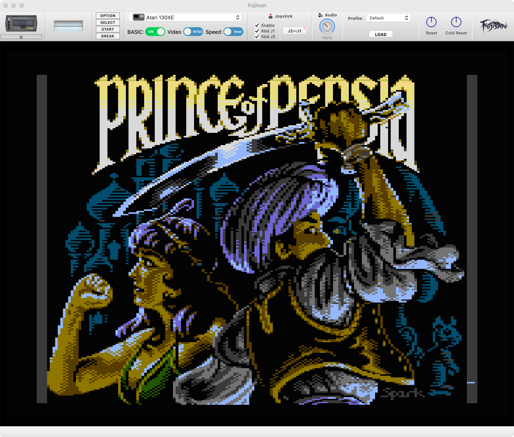

# Fujisan - Modern Atari Emulator


A modern frontend for the Atari800 emulator, providing a native desktop experience with full keyboard support, machine configuration, and authentic Atari behavior.

**Motivation**

"Do we really need a new emulator?" some of you might be asking. And a simple answer is, "no, not really". But, to be precise, Fujisan is a UI built on top of Atari800, so it is not really a new emulator, but a new way to use Atari800. Users have plenty of good options with Altirra, Atari800 (vanilla), Atari800MacX and Mame. One thing that Atari800 has that is great, but it throws some users off, is its built-in UI inside the emulator window. A lot of users prefer to have the native feeling like Altirra on Windows, and Atari800MacX on macOS delivers. 

Fujisan is an AI-based exercise and hobby for me, to build an emulator tailored to my personal use, with fewer customization available but ready to go for 90% of the use cases. Hopefully it will attract more people like me. Also, the fact that the users will have the same native experience in Windows, MacOS or Linux is a differentiator compared to the other emulators.

Another important objective is to always use **libatari800** so there is never incompatibility between the Atari800 source code and Fujisan (as much as possible). There are some patches I had to apply, but I am set to always make it easier for anyone that wants to build Fujisan, to be able to reproduce my steps and patch atari800 properly (There is a patches folder with detailed instructions).

I guess, the big difference is that Fujisan is a UI-based emulator that is available for Windows, Mac, and Linux. (The builds and binaries will be available soon), and overtime, with some features that will help software development.




## Features

### Emulator Integration
- **libatari800 Integration**: Uses the same proven emulator core
- **Authentic Display**: 384x240 full screen resolution with proper Atari colors
- **Pixel Perfect Scaling**: Integer scaling for crisp, retro graphics
- **Real-time Performance**: Proper 49.86 FPS (PAL) / 59.92 FPS (NTSC) timing

### User Interface
- **Native Menus**: Standard desktop menu bar and dialogs
- **File Management**: Native file dialogs for ROM loading
- **Status Bar**: Real-time feedback for user actions
- **Focus Management**: Click-to-focus emulator display

### Developer Friendly

- Built-in TCP Server API - Fujisan includes a powerful TCP server for remote control and automation. This enables IDE integration, automated testing, and programmatic control of all emulator features. See usage below for more details

### Keyboard Input
- **Full Keyboard Support**: All letters, numbers, and symbols
- **Shifted Symbols**: Proper handling of `!@#$%^&*()` and punctuation
- **Special Keys**: Enter, arrows, function keys, Escape, Backspace
- **Control Combinations**: Ctrl+C for break, Ctrl+letters for control codes
- **Real-time Response**: Direct input to emulator without lag

### System Control
- **BASIC Toggle**: Enable/disable BASIC ROM loading
- **Cold/Warm Boot**: System restart options
- **Dynamic Restart**: Apply BASIC settings without restarting GUI
- **ROM Loading**: Support for .rom, .bin, .car, .atr files

### Network Features
- **NetSIO/FujiNet Support**: Connect to FujiNet-PC for network-enabled Atari programs
- **Automatic Configuration**: Auto-disable BASIC and local disks when NetSIO enabled
- **Smart Restart**: Seamless NetSIO toggle without application restart
- **Boot Priority**: FujiNet devices take precedence over local disk images

### Printer Support
- **P: Device Status**: Currently disabled due to limitations in atari800 core P: device emulation
- **Error 138 Issue**: LPRINT and LIST "P:" commands result in device timeout errors
- **Implementation Ready**: Full printer UI and backend code implemented but commented out
- **Future Support**: Will be re-enabled when P: device emulation is fixed in atari800 core

### Debugging & Development
- **Integrated Debugger**: Comprehensive 6502 debugging with breakpoints, stepping, and memory inspection
- **Breakpoint System**: Set/remove breakpoints with automatic execution pause and visual indicators
- **CPU State Monitoring**: Real-time register display (A, X, Y, PC, SP, P) in hex format
- **Memory Viewer**: Hex dump with ASCII display for full 64KB address space analysis
- **Disassembly Engine**: Full 6502 instruction set with proper mnemonics and addressing modes
- **Execution Control**: Step Into (F11), Step Over (F10), Run (F5), and Pause capabilities
- **TCP Server API**: Remote control via JSON commands for IDE integration and automated testing
- **Multi-client Support**: Event broadcasting and simultaneous connections for development workflows

### Technical Features
- **Color Accuracy**: Uses actual Atari color table from libatari800
- **Memory Efficiency**: Direct screen buffer access
- **Cross-platform**: Qt5 ensures compatibility across desktop platforms
- **Clean Architecture**: Separated emulator core, display widget, and UI

## Building

### Prerequisites
- **Qt5** (Core, Widgets, Gui modules)
- **CMake 3.16+**
- **C++17 compatible compiler**
- **Atari800 source code** (download from https://github.com/atari800/atari800)
- **autoconf** and **automake** (for building atari800)
- **Environment variable**: `export ATARI800_SRC_PATH=/path/to/atari800-src`

### Platform-Specific Setup

#### **macOS**
```bash
# Install Qt5 via Homebrew (recommended)
brew install qt@5

# Install CMake if not available
brew install cmake

# Install autotools for building atari800
brew install autoconf automake

# Add Qt5 to PATH (if needed)
export PATH="/opt/homebrew/opt/qt@5/bin:$PATH"
```

#### **Linux (Ubuntu/Debian)**
```bash
# Install Qt5 development packages
sudo apt update
sudo apt install qtbase5-dev qtchooser qt5-qmake qtbase5-dev-tools

# Install CMake and build tools
sudo apt install cmake build-essential

# Install autotools for building atari800
sudo apt install autoconf automake
```

#### **Linux (CentOS/RHEL/Fedora)**
```bash
# For CentOS/RHEL
sudo yum install qt5-qtbase-devel cmake gcc-c++

# For Fedora
sudo dnf install qt5-qtbase-devel cmake gcc-c++
```

#### **Windows**
1. **Install Qt5**: Download from [qt.io](https://www.qt.io/download-qt-installer)
   - Choose Qt 5.15.x or later
   - Select "MSVC 2019 64-bit" or "MinGW" kit
2. **Install CMake**: Download from [cmake.org](https://cmake.org/download/)
3. **Install Visual Studio 2019+** (for MSVC) or **MinGW** (for GCC)

### Build Steps

#### **Step 1: Set Environment Variable**
```bash
export ATARI800_SRC_PATH=/path/to/atari800-src
```
**Note**: This environment variable needs to be set in each terminal session or shell where you run the build commands. If you get "environment variable not set" errors, set it again in your current shell.

#### **Step 2: Apply Fujisan Patches to Atari800**
```bash
cd fujisan/patches
./apply-patches.sh
```

#### **Step 3: Build libatari800**
```bash
cd $ATARI800_SRC_PATH
./autogen.sh              # Generate configure script (requires autoconf/automake)
./configure --target=libatari800
make
```

**Note**: If you get errors about missing auxiliary files when running `./configure`, make sure you've run `./autogen.sh` first.

#### **Step 4: Build Fujisan**

**Important**: We recommend out-of-source builds to keep the source directory clean. If you previously built in-source, clean up first:
```bash
# Clean up any previous in-source build files
cd /path/to/fujisan
rm -rf CMakeCache.txt CMakeFiles/ Makefile cmake_install.cmake Fujisan_autogen/
```

**macOS/Linux:**
```bash
# Navigate to Fujisan directory
cd /path/to/fujisan

# Create and enter build directory
mkdir -p build
cd build

# Configure with CMake (ATARI800_SRC_PATH must be set)
ATARI800_SRC_PATH=/path/to/atari800-src cmake ..
# OR for macOS with Homebrew Qt5:
# ATARI800_SRC_PATH=/path/to/atari800-src CMAKE_PREFIX_PATH="/opt/homebrew/opt/qt@5" cmake ..

# Build
make

# Run
./fujisan
```

**Windows (Visual Studio):**
```batch
REM Navigate to Fujisan directory
cd fujisan

REM Create build directory
mkdir build
cd build

REM Configure (adjust Qt path as needed)
cmake -DCMAKE_PREFIX_PATH="C:\Qt\5.15.2\msvc2019_64" ..

REM Build
cmake --build . --config Release

REM Run
Release\fujisan.exe
```

**Windows (MinGW):**
```batch
REM Navigate to Fujisan directory  
cd fujisan

REM Create build directory
mkdir build
cd build

REM Configure
cmake -G "MinGW Makefiles" -DCMAKE_PREFIX_PATH="C:\Qt\5.15.2\mingw81_64" ..

REM Build
mingw32-make

REM Run
fujisan.exe
```

### Troubleshooting Build Issues

#### **"Qt5 not found" Error**
```
Could NOT find Qt5 (missing: Qt5_DIR)
```
**Solution**: Set the correct Qt5 path:
- **macOS**: `CMAKE_PREFIX_PATH="/opt/homebrew/opt/qt@5" cmake ..`
- **Linux**: Install Qt5 dev packages or set path
- **Windows**: `cmake -DCMAKE_PREFIX_PATH="C:\Qt\5.15.2\msvc2019_64" ..`

#### **"libatari800 not found" Error**
```
FATAL_ERROR: libatari800 not found
```
**Solution**: Build libatari800 first:
```bash
cd /path/to/atari800-src
./configure --target=libatari800
make
```

#### **"configure: No such file" Error**
```
bash: ./configure: No such file or directory
```
**Solution**: Generate the configure script first:
```bash
cd $ATARI800_SRC_PATH
./autogen.sh
./configure --target=libatari800
```

#### **"ATARI800_SRC_PATH environment variable not set" Error**
```
CMake Error at CMakeLists.txt:19 (message):
  ATARI800_SRC_PATH environment variable not set.
```
**Solution**: Set the environment variable when running cmake:
```bash
ATARI800_SRC_PATH=/path/to/atari800-src cmake .
# For macOS with Homebrew Qt5:
ATARI800_SRC_PATH=/path/to/atari800-src CMAKE_PREFIX_PATH="/opt/homebrew/opt/qt@5" cmake .
```

#### **"unexpected end of file in patch" Error**
```
patch: **** unexpected end of file in patch
```
**Solution**: This indicates corrupted patch files. Pull the latest fixes:
```bash
cd fujisan
git pull
```

#### **Missing Build Tools**
- **macOS**: Install Xcode Command Line Tools: `xcode-select --install`
- **Linux**: Install build-essential: `sudo apt install build-essential`
- **Windows**: Install Visual Studio with C++ tools

### Cleaning Build Files

If you need to clean your build and start fresh:

#### **Out-of-source build (recommended)**
```bash
# Simply remove the build directory
rm -rf build/
```

#### **In-source build cleanup**
```bash
# Remove all CMake-generated files
rm -rf CMakeCache.txt CMakeFiles/ Makefile cmake_install.cmake Fujisan_autogen/
# Remove compiled binary
rm -f Fujisan fujisan Fujisan.exe
```

### Running
```bash
# macOS/Linux
./fujisan

# Windows
fujisan.exe
```

## Usage

### Getting Started
1. Launch the application
2. The emulator starts with BASIC enabled by default
3. Click on the display area to focus keyboard input
4. Type BASIC commands and press Enter

### Loading ROMs
- **File → Load ROM...**: Open native file dialog
- Supports common Atari formats (.rom, .bin, .car, .atr)
- ROMs load immediately with automatic restart

### System Control
- **File → Cold Boot**: Complete system restart
- **File → Warm Boot**: Soft restart (preserves some state)
- **System → Enable BASIC**: Toggle BASIC ROM loading
- **System → Restart**: Apply BASIC setting changes

### NetSIO/FujiNet Usage
- **Settings → Hardware → NetSIO**: Enable network connectivity to FujiNet-PC
- **Automatic Setup**: BASIC is auto-disabled when NetSIO enabled (required for FujiNet boot)
- **Disk Priority**: Local disk images are auto-dismounted to ensure FujiNet boot priority
- **FujiNet-PC**: Must be running on UDP port 9997 for connection
- **Network Programs**: Access to online services, file sharing, and multiplayer games

### Keyboard Input
- **Letters**: Automatically converted to uppercase (Atari standard)
- **Enter**: Execute BASIC commands or confirm actions
- **Arrows**: Navigate cursor in BASIC
- **F1-F4**: Function keys (context-dependent)
- **Ctrl+C**: Break/interrupt running programs
- **Shift+Numbers**: Access symbols `!@#$%^&*()`

### Known Limitations
- **Printer Support**: P: device (printer) functionality is currently disabled due to Error 138 (Device Timeout) issues in the atari800 core. Commands like `LPRINT` and `LIST "P:"` will not work. This limitation also affects the official atari800 emulator and is not specific to Fujisan.

## TCP Server API

Fujisan includes a powerful TCP server for remote control and automation. This enables IDE integration, automated testing, and programmatic control of all emulator features.

### Enabling the Server
1. Go to **Tools → TCP Server** in the menu
2. Server starts on `localhost:8080`
3. Multiple clients can connect simultaneously

### Key Features
- **JSON Protocol**: Simple command/response format
- **Complete Control**: Media, system, input, debug, and configuration commands
- **Event Broadcasting**: Real-time notifications to all connected clients
- **Security**: Localhost-only binding for safety

### Quick Example
```bash
# Get emulator state
echo '{"command": "status.get_state"}' | nc localhost 8080

# Load a disk
echo '{"command": "media.insert_disk", "params": {"drive": 1, "path": "/path/to/disk.atr"}}' | nc localhost 8080

# Send text to emulator
echo '{"command": "input.send_text", "params": {"text": "LOAD \"D:*\"\n"}}' | nc localhost 8080
```

### Complete Documentation
See **[TCP_SERVER_API.md](TCP_SERVER_API.md)** for comprehensive API documentation with examples for all 34+ available commands covering media control, debugging, configuration, and automation.

## Debugging

Fujisan includes a comprehensive debugger for analyzing and debugging Atari 8-bit programs. Access it via **Tools → Debug Window** in the menu bar.

### Debugger Features

#### **CPU State Monitoring**
- **Registers**: Real-time display of A, X, Y, PC, SP, and P registers
- **Hex Format**: All values shown in standard 6502 hex notation ($xx/$xxxx)
- **Live Updates**: Registers update automatically during emulation

#### **Execution Control**
- **Step Into** (`F11`): Execute one instruction at current PC
- **Step Over** (`F10`): Step over subroutine calls (JSR instructions)
- **Run** (`F5`): Continue execution from current state
- **Pause**: Stop execution and examine current state

#### **Breakpoint System**
- **Set Breakpoints**: Enter any address ($0000-$FFFF) and click "Add"
- **Visual Indicators**: Breakpoints marked with `B` in disassembly view
- **Automatic Pause**: Execution stops when PC reaches breakpoint address
- **Management**: Add, remove, or clear all breakpoints
- **Persistence**: Breakpoints saved between sessions
- **Keyboard Shortcut**: `Ctrl+B` to add breakpoint at current address

#### **Disassembly View**
- **Current Instruction**: Highlighted display of instruction at PC
- **Instruction Window**: Scrollable view of surrounding code
- **Proper Mnemonics**: Full 6502 instruction set with operands
- **Address Modes**: Correct display of immediate (#$xx), absolute ($xxxx), indexed, etc.
- **Visual Markers**: 
  - `->` marks current PC location
  - `B` marks breakpoint addresses
- **Auto-Centering**: Current PC automatically centered when paused

#### **Memory Viewer**
- **Hex Dump**: Traditional hex editor style display
- **ASCII Column**: Printable characters shown alongside hex values
- **Address Navigation**: Jump to any memory location ($0000-$FFFF)
- **Live Display**: Memory contents update in real-time
- **Scrollable**: View any portion of 64KB address space

### Debugging Workflow

#### **Setting Up Debug Session**
1. **Open Debugger**: Tools → Debug Window
2. **Set Breakpoints**: Enter addresses where you want execution to pause
3. **Start Program**: Load ROM/disk and run normally
4. **Pause Execution**: Use Pause button or wait for breakpoint

#### **Typical Debug Workflow**
```
1. Set breakpoint at program entry point (e.g., $2000)
2. Press Run to start execution
3. Emulator pauses at breakpoint automatically
4. Examine CPU registers and memory state
5. Step through code with F11 (Step Into) or F10 (Step Over)
6. Set additional breakpoints as needed
7. Continue with F5 (Run) to next breakpoint
```

#### **Breakpoint Management**
- **Add**: Enter address and click "Add" or press `Ctrl+B`
- **Remove**: Select breakpoint in list and click "Remove"
- **Clear All**: Remove all breakpoints at once
- **Visual**: Breakpoints shown with `B` marker in disassembly

#### **Memory Analysis**
- **Jump to Address**: Change memory viewer address to examine specific locations
- **Watch Variables**: Monitor memory locations for data changes
- **Stack Analysis**: Check stack pointer (SP) and stack contents
- **Zero Page**: Examine zero page variables ($00-$FF)

#### **Code Analysis**
- **Subroutine Calls**: Use Step Over (F10) to skip JSR instructions
- **Instruction Flow**: Use Step Into (F11) to trace exact execution path
- **Branch Analysis**: See branch targets and conditional execution
- **Address Modes**: Understand how instructions access memory

### Debug Information Display

#### **CPU Registers Format**
```
A: $FF  X: $00  Y: $00
PC: $2000  SP: $FF  P: $34
```

#### **Disassembly Format**
```
   $1FFE: 20 00 20  JSR $2000
B  $2001: A9 FF     LDA #$FF      <- Breakpoint
-> $2003: 85 10     STA $10       <- Current PC
   $2005: 60        RTS
```

#### **Memory Dump Format**
```
0800: 20 00 E4 20 5C E4 A2 00 A0 02 20 5A E4 06 07 A5 |  .ä \ä¢ ¥ Zä..¥
0810: 07 D0 FB A6 07 A4 08 20 A5 E4 A9 9B 20 D2 FF A9 |.ÐûÞ¤. ¥ä© ÒÿÞ
```

### Debugging Tips

#### **Common Breakpoint Locations**
- **Program Start**: Main program entry point
- **Interrupt Vectors**: IRQ/NMI handlers ($FFFE, $FFFA)
- **System Calls**: OS ROM routines
- **Critical Loops**: Main game/program loops
- **Error Conditions**: Error handling code

#### **Performance Considerations**
- **Minimize Breakpoints**: Too many can slow execution
- **Use Step Over**: For subroutines you don't need to trace
- **Pause When Needed**: Continuous debugging updates use CPU cycles

#### **Memory Regions of Interest**
- **Zero Page** ($00-$FF): Fast access variables
- **Page 2** ($200-$2FF): System stack
- **Page 6** ($600-$6FF): Common program area
- **System Variables** ($00-$7F): OS variables

### Advanced Debugging

#### **Instruction Set Knowledge**
Understanding 6502 assembly helps with debugging:
- **Branch Instructions**: BEQ, BNE, BCC, BCS affect program flow
- **Subroutine Calls**: JSR pushes return address to stack
- **Stack Operations**: PHA/PLA, PHP/PLP for register save/restore
- **Addressing Modes**: Zero page vs absolute addressing

#### **Atari-Specific Debugging**
- **ANTIC/GTIA**: Graphics chips affect display
- **POKEY**: Sound and I/O operations
- **PIA**: Joystick and keyboard input
- **Device Handlers**: Disk, cassette, printer operations

The debugger provides powerful tools for understanding and debugging Atari 8-bit programs, from simple BASIC programs to complex assembly language applications.

## Architecture

### Components
- **AtariEmulator**: Core emulator integration and input handling
- **EmulatorWidget**: Qt widget for display and input capture
- **MainWindow**: Application window with menus and layout
- **DebuggerWidget**: Comprehensive debugging interface with breakpoints and execution control
- **main.cpp**: Application entry point and initialization

### Design Principles
- **Separation of Concerns**: Emulator logic separate from UI
- **Qt Best Practices**: Proper signal/slot usage, event handling
- **Performance**: Direct screen buffer access, integer scaling
- **Maintainability**: Clear class structure, documented interfaces

## Development Notes

### Key Classes
- `AtariEmulator`: Manages libatari800 lifecycle and input
- `EmulatorWidget`: Handles display rendering and keyboard events
- `MainWindow`: Provides menus and application structure
- `DebuggerWidget`: Provides debugging capabilities with breakpoint management and 6502 analysis

### Input Handling
- Qt key events converted to Atari key codes
- Direct mapping for letters, numbers, symbols
- Special handling for Enter, arrows, function keys
- Modifier key support (Shift, Ctrl)

### Display Pipeline
1. libatari800 generates 384x240 screen buffer
2. Display full 384x240 area without cropping
3. Convert color indices to RGB using Colours_table
4. Update QImage with converted pixels
5. Scale and display with QPainter using 98% of available space

### Timing
- QTimer drives frame updates at proper Atari speed
- Frame rate automatically detected from libatari800
- Consistent timing across different systems